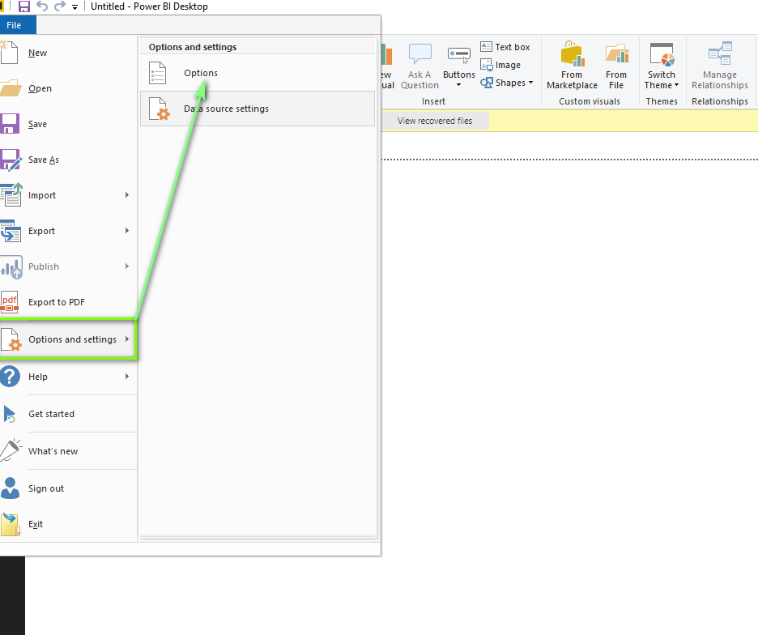
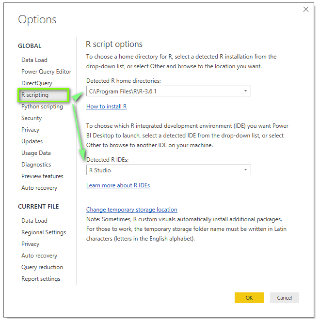
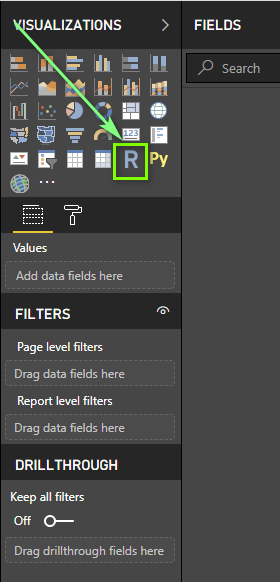
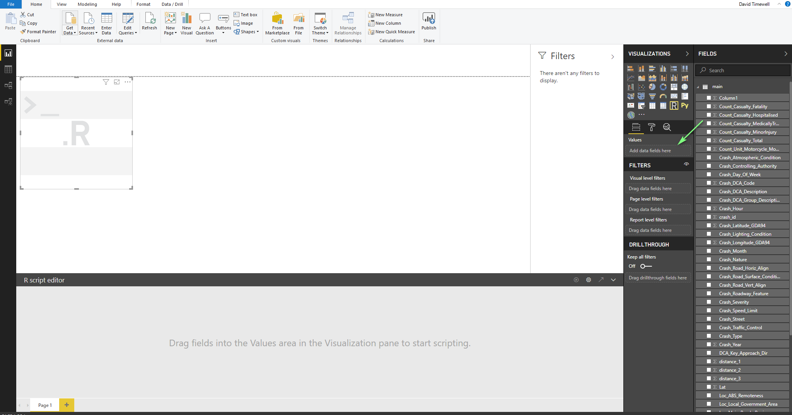
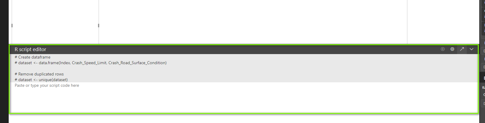
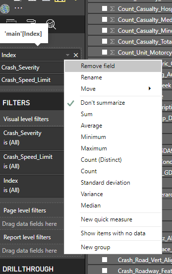
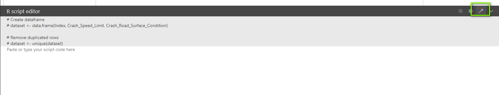
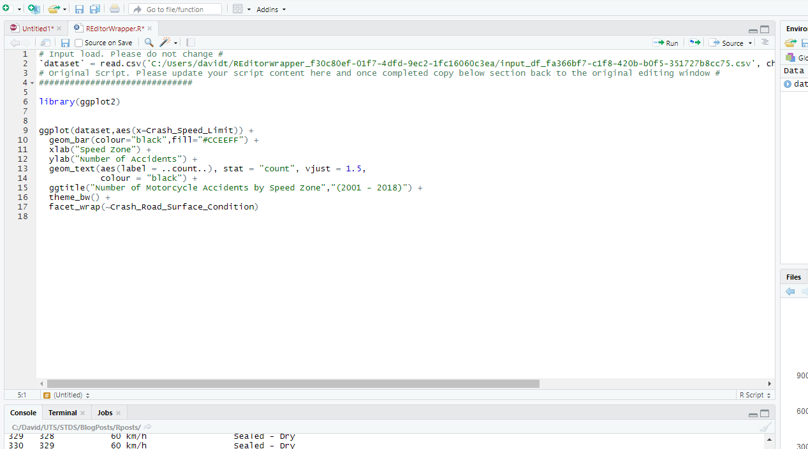
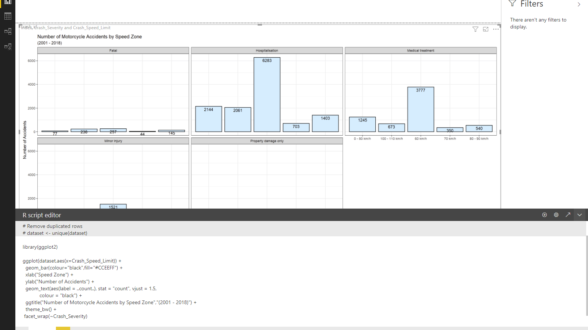

A quick guide to get R scripts running in PowerBI.
<!--more-->

## Introduction :

This serves as a quick guide to get R scripts running in PowerBI


### Step 1 - Install R


R can be installed from the following link : https://cran.r-project.org/bin/windows/base/
Remember where you installed it.

### Step 2  - Setup R in PowerBI


Go to File -> Options and Setting -> Options


```{r add_picture9991, echo=FALSE}

```


Select R scripting from the side menu an then input your install path. For the IDE I set mine to RStudio.
For RStudio install instructions See 

https://www.datacamp.com/community/tutorials/installing-R-windows-mac-ubuntu?utm_source=adwords_ppc&utm_campaignid=898687156&utm_adgroupid=48947256715&utm_device=c&utm_keyword=&utm_matchtype=b&utm_network=g&utm_adpostion=&utm_creative=229765585183&utm_targetid=dsa-429603003980&utm_loc_interest_ms=&utm_loc_physical_ms=1000149&gclid=Cj0KCQjwtZH7BRDzARIsAGjbK2YH3kiq7Fy3bc9cS001_3hbuutZ_e00QOKK2pYwJLHuzjMKAWC96oEaAhpQEALw_wcB


```{r add_picture9992, echo=FALSE}

```


Under visualisations you should now see the R icon.


```{r add_picture9993, out.width="50%", echo=FALSE}

```


Once the R icon is selected we can start dragging fields from our data set.


```{r add_picture9994,out.width="100%", echo=FALSE}

```


Note we now have an R script editor window. We can optionally type our code into. 
Observe the uneditable code put in by PowerBI to remove duplicate rows.
This can cause issues if you don't have an index column for obvious reasons. 


```{r add_picture9995, echo=FALSE}

```


Make sure your index column is set to not summarise. This will prevent PowerBI from summing it in the data set. 


```{r add_picture9996,out.width="50%", echo=FALSE}

```


I would highly recommend writing your code in R Studio by the selecting edit script in external IDE. 


```{r add_picture9997,out.width="100%", echo=FALSE}

```


PowerBI creates an REditorWrapper script with the data set ready to load.
You can now write your code and take avantage of the benefits of writing in an IDE.


```{r add_picture9998,out.width="100%", echo=FALSE}

```


Once Finished and tested in RStudio,  paste your code back into PowerBI and run


```{r add_picture9999,out.width="100%", echo=FALSE}

```


