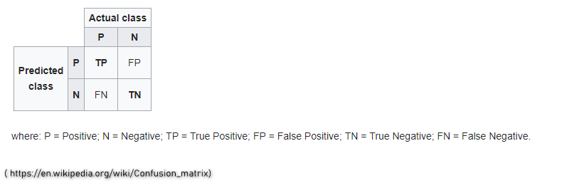

On a recent project using logistic regression whilst testing my model accuracy, adjusting the classification threshold and creating many confusion matrices. I later found that using a ROC curve was a better approach to finding the optimal threshold.

<!--more-->


```{r setup, include=FALSE}
knitr::opts_chunk$set(echo = TRUE)
```


## Introduction

On a recent project using logistic regression whilst testing my model accuracy, adjusting the classification threshold and creating many confusion matrices. I later found that using a ROC curve was a better approach to finding the optimal threshold.


```{r warning=FALSE}

library(caTools)
library(caret)
library(readr)
library(tidyverse)
library(ROCR)


set.seed(42)

```


## The ROC curve


THe ROC curve (reciever operating characteristic curve) 

```{r add_picture9995, out.width="50%",echo=FALSE}
knitr::include_graphics("img/ROCCurve.png")
```

The ROC curve plots the true positive rate (the predictions our model got correct) versus the false positive rate (the predictions our model got incorrect)
From the diagram we see the horizontal line which is no better than random guessing. The area under horizontal line is .5. Our ideal model would be at the red dot where our 
true positive rate (TPR) is 1 and our area under the curve is 1. Here we would have 100 % true positive and zero false positive.


## Get data 


First up I will load up some sample data. For this I am using the Cleveland heart disease data set.
For more info : https://archive.ics.uci.edu/ml/datasets/heart+disease


```{r echo=FALSE}


hd_data <- read.csv("data/Cleveland_hd.csv")
```


I want to change the class to a binary outcome. So 1 has heart disease and 0 does not. I will also change the sex field and convert over to factors.

```{r}


hd_data %>% mutate(hd = ifelse(class > 0, 1, 0))-> hd_data
hd_data %>% mutate(sex = ifelse(sex == 0, "F", "M"))-> hd_data
hd_data$hd <- factor(hd_data$hd )
hd_data$sex <- factor(hd_data$sex )


```


Now we can glimpse the data just to orientate ourselves. Note we have 303 observations.

```{r}

glimpse(hd_data)


```


Next we shuffle our data to avoid any bias that may be in the data set as a result of the default ordering. We then  split our data into  test and training set using a 70:30 split.

```{r}

# Get the number of observations
n_obs <- nrow(hd_data)

# Shuffle row indices: permuted_rows
permuted_rows <- sample(n_obs)

# Randomly order data: Sonar
model_shuffled <- hd_data[permuted_rows, ]

# Identify row to split on: split
split <- round(n_obs * 0.7)

# Create train
train <- model_shuffled[1:split, ]

# Create test
test <- model_shuffled[(split + 1):n_obs, ]


```

## Build a logistic regression model

Now we build our logistic regression model to see if we can predict heart disease using our predictors. 
Note for this example I have only used two predictors. To test the if there is a significant relationship between the predictors and response variable (hd)
you can use Chi squared test to calculate p-values. I won't go into this here. 

```{r}

glm_model <- glm(data = train, hd ~ age + sex + thalach, family = "binomial" )

summary(glm_model)
```


## Test the model and create a confusion matrix and ROC curve

Now lets test our model against the test set and create a confusion matrix. Note a cassification threshold of .5 is set initially.

```{r}

# Predict on test
p <- predict(glm_model, test, type = "response")


# If p exceeds threshold of 0.5, 1 else 0
hd_or_nohd <- ifelse(p > 0.5, 1, 0)

# Convert to factor: p_class
p_class <- factor(hd_or_nohd, levels = levels(test[["hd"]]))


# Create confusion matrix
confusionMatrix(p_class, test[["hd"]])


```

Below gives an idea of how the matrix is structured (https://en.wikipedia.org/wiki/Confusion_matrix)

```{r add_picture9996, out.width="100%", echo=FALSE}

```


So from looking at the above and our subsequent confusion matrix we have :
 
 * Accuracy of 64% being our TP / (TP + FP)
 
 * Sensitivity of 62% being our TP / P
 
 * Specificity of 69%  being our TN / N
 
 
 
 We could then go on to create many confusion matrices as we adjust the classification threshold and compare to others we created.
 This is not ideal.


Now let's plot a ROC curve


```{r}

roc_pred <- prediction(predictions = p  , labels = test$hd)
roc_perf <- performance(roc_pred , "tpr" , "fpr")
plot(roc_perf,
     colorize = TRUE,
     print.cutoffs.at= seq(0,1,0.05),
     text.adj=c(-0.2,1.7))

```

The x axis is the false positive rate and the y axis is the true positive rate. We can see each of the points represents a confusion matrix (like we created above) which we don't have to evaluate manually. The points represent the tradeoff between true positive and false positive.
By looking at the graph we can choose the optimal threshold depending on how many false positives(FP) we are willing to accept.


AUC


We can also calculate the area under the ROC curve.
If we look at the area under the curve a perfect model would give an AUC of exactly 1.00 and the average AUC for a random model is .5 (no better than random guessing) as the plot represents a diagonal line.
AUC is a single number summary that allows us to evaluate the model accuracy without looking at confusion matrices. Typically we want a model with .8 or higher.
We can also use this to compare AUC against other models. 

```{r}

 (auc_ROCR <- performance(roc_pred, measure = "auc"))
 (auc_ROCR <- auc_ROCR@y.values[[1]])


```


From here one way to improve our model woul be to include aditional revelant predictors.

