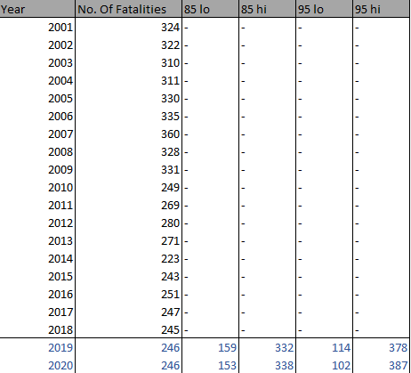

A look into time series analysis using QLD road accident data.

<!--more-->

```{r setup, include=FALSE}
knitr::opts_chunk$set(echo = TRUE)
```

```{r,echo=FALSE,warning=FALSE,message=FALSE}
library(forecast) # the main package for time series forecasting
library(urca) # unit root tests for stationarity
library(tidyverse) # ggplot2 and piping operator
library(sqldf)
library(readr)
library(astsa)

```

```{r,echo=FALSE,warning=FALSE,message=FALSE}
set.seed(43)
#data summary

#crash_all_grp_year <- sqldf("select SUM(Count_Casualty_Fatality)  as count_crash, Crash_Year from crash_all group by Crash_Year")
#write_csv(crash_all_grp_year,"../Rposts/data/write_crash_year.csv")
#Use this
crash_all <- read_csv("data/locations.csv")
#str(crash_all)
#Count_Casualty_Total
#Count_Casualty_Hospitalised 
crash_all_grp <- sqldf("select Count_Casualty_Fatality  as count_crash, Crash_Year||'-'||Crash_Month,
                   case when Crash_Month = 'January'then 1 
                   when Crash_Month = 'February'then 2 
                   when Crash_Month = 'March'then 3 
                   when Crash_Month = 'April'then 4 
                   when Crash_Month = 'May'then 5 
                   when Crash_Month = 'June'then 6 
                   when Crash_Month = 'July'then 7 
                   when Crash_Month = 'August'then 8 
                   when Crash_Month = 'September'then 9 
                   when Crash_Month = 'October'then 10 
                   when Crash_Month = 'November'then 11 
                   when Crash_Month = 'December'then 12 
                   
                   else 99 end as num_month
                           ,Crash_Year
                   from crash_all   ")
#Count_Unit_Motorcycle_Moped > 0

#sqldf("select * from crash_all_grp where num_month = 99")

crash_all_grp_order <- sqldf("select sum(count_crash) as sum_crash ,Crash_Year||'_'|| num_month from crash_all_grp group by Crash_Year||'_'|| num_month  order by Crash_Year,num_month ")

#write_csv(crash_all_grp_order,"../Rposts/data/write_crash.csv")


y_f = ts(crash_all_grp_order$sum_crash,start=c(2001,1), end=c(2018,12),frequency=12)


#autoplot(y)
#win_y = window(y, start = c(2014, 01))
#y_diff <- diff(y)


#

#ggAcf(y)
#Box.test(y, lag = 24, fitdf = 0, type = "Ljung")

#decompose(y) %>% autoplot()
#y %>% tseries::adf.test()
#y %>% ur.kpss() %>% summary()
#y %>% diff() %>% tseries::adf.test()
#y %>% diff() %>% ur.kpss() %>% summary()

#ggsubseriesplot(y)
#ggseasonplot(y)

```


# Introduction

The Queensland government estimates that the cost of fatalities and hospitalisations for 2014 alone is estimated at over $5 billion (Safer Roads, Safer Queensland: Queensland’s Road Safety Strategy 2015-21,2019). In a recent report the estimated cost for 2018 was also put at $5 billion. With 15 percent of hospital admissions attributed to transport crashes according to Queensland Health data (Big Data to Crunch the Numbers on Road Safety, n.d.).
The costs of one accident are many and the resulting effect on the families and the community can be devastating Fig.0.

```{r add_picture2, echo=FALSE,fig.cap="Fig.0 (Cost of one Accident)",out.width="100%",out.height="100%"}
knitr::include_graphics("data/cost_of_one_crash.png")
```


Given the huge costs and devastating impact of road accidents,  the vision for the future of the Queensland government is to reduce accident fatalities and hospitilisations to zero. Although the vision is to reduce accidents to zero, some of the goals set out in the Queensland Road Safety strategy 2015-21 is to :

 * Reduce fatalities from 303 (average 2008-2010) to fewer than 200 by 2020. 
 * Reduce hospitalised casualties from 6,670 (average 2008-2010) to 4,669 or fewer by 2020.


#  Background


For the initial analysis tasks our group decided to use data from the Queensland department of transport and main roads to investigate motorcycle crash statistics.
In the initial presentation for motorcycle accidents there was a declining trend in fatalities but a slightly increasing trend in hospitalisations from 2017.

The goal of this paper is to extend the analysis to all road users with focus being on fatalities, as this has traditionally being the main focus. Time series analysis will be used to forecast fatalities and get an idea of how the government is tracking to the proposed goal of 200 or fewer fatalities by 2020.

# Proposed question for this assignment 

The question for this assignment will be how well the Queensland government is tracking toward reducing fatalities to zero in the long term, and in the short term will 
the goal of fewer than 200 fatalities by 2020 be met.


# Data and Methodology

The data selected for analysis is the same dataset used for all previous assignments but this time not limited to just motorcycle road users.
As stated in the background, the focus will be on fatalities. The data for this assignment has been converted to a time series object.

The general methodology used will be :

 * Exploratory analysis of the time series data. This will help to identify trends, seasonality and cyclic behaviours
 * Choosing and fitting models.
 * Evaluating fit with train and test sets, cross validation and residual diagnostics.
 * Forecasting using the model with the best fit.  


### Exploratory Analysis

For time series analysis we have enough data as our data set ranges from 2001 - 2018.

The first characteristics for a time series dataset we will be looking at are :

 * Trend : long term increase or decrease in the data
 
 * Seasonality : Regular pattern in the time series related to the calendar. examples are quarter, month or day of week.

 * Cyclic : Rises and falls that are not of a fixed period. This could be patterns exhibited over many years.

From an initial plot of the time series data Fig.1,  we see that the general trend does appear to be downward. There also appears to be some seasonality.

```{r, echo=FALSE,fig.cap="Fig.1 (Plot of timeseries)"}

autoplot(y_f,main = "Initial plot of timeseries data", ylab = "No. of Fatalities")


```


Decomposing the timeseries into it's individual elements, patterns in the timeseries become more clear.
Looking at the trend in Fig.2 , there have been significant drops since 2006. From 2015 the general trend may be creeping up. 
By decomposing the timeseries it also allows seasonality to be seen more clearly. Looking at Fig.2 there seems to be a seasonal pattern.


```{r,echo=FALSE,fig.cap = "Fig.2 (Decomposition of timeseries)"}

decompose(y_f) %>% autoplot()


```


Running an autocorrelation plot against the timeseries data Fig.3, a "scalloped" pattern can be seen. This "scalloped" pattern can be an indication of seasonality or cyclic behaviour.
Seasonality shows up as spikes and because the timeseries data is monthly a large spike at lag 12 is observed.


```{r,echo=FALSE,fig.cap = "Fig.3 (ACF plot of timeseries)"}

ggAcf(y_f)


```

The partial auto correlation Fig.4 also shows a spike at lag 12 among others.


```{r,echo=FALSE,fig.cap = "Fig.4 (PACF of timeseries)"}


ggPacf(y_f)


```


The subseries plot in Fig.5 allows the seasonality to be seen more clearly and shows seasonality changes over time. Investigations of seasonality in Fig.5 show August to be the highest month for fatalities and  February to be the lowest.

```{r,echo=FALSE,fig.cap = "Fig.5 (Subseries plot of timeseries)" }

ggsubseriesplot(y_f)

```


### Choosing and fitting models


#### ARIMA models

ARIMA (Auto-Regressive Integrated Moving Average) models describe autocorellations in data.
ARIMA models will be the one of modelling technique that will be used in this analysis.
ARIMA models and exponential smoothing models are the two most widely used approaches for time series forecasting. 

ARIMA models are characterised by parameters p,d and q. 

 * p represents the number of AR(auto regressive) components. 0 if there is no relationship between adjacent observations.
 
 * d is the degree of differencing that is applied to the data

 * q represents the number of MA(moving average) components.  


Where we have a seasonal element in our time series the notation is extended to include :
ARIMA (p,d,q)(P,D,Q) where P,D and Q are parameters for seasonality.

#### Stationary data

One requirement for ARMA models is that  time series data be stationary meaning the mean, variance and covariance do not vary with time.
ARIMA models address this with the integration component being the "I" in ARIMA. The "I" addresses the degree of differencing needed to make the data stationary.
By looking at the data plotted from the timeseries in Fig.1 , it would suggest that the mean is not constant and the variability around the mean is not stable. 
Looking at the ACF plot in Fig.3 and PACF plot in Fig.6,  the lags do not decrease fast to zero and there are many significant lags. 


To confirm the initial assessments that the time series data are non-stationary the KPSS (Kwiatkowski-Phillips-Schmidt-Shin) test is run.
For this test the results of the test exceeds the critical value of 1% and is not stationary as can be seen in Fig.7.

```{r,echo=FALSE,fig.cap="Fig.7 (KPSS test of timeseries)"}

y_f  %>% ur.kpss() %>% summary()

```
Fig.7 (KPSS test of timeseries)

We can remove the non-stationary characteristic of the time series by differencing the data. The number of times we need to difference the data determines the value d in our ARIMA model.
Differencing simply subtracts the value from an earlier observation in the time series from a later observation. 
Fig.8 shows the KPSS (Kwiatkowski-Phillips-Schmidt-Shin) test after differencing.
We now have a value of 0.015 which is under the critical value of 1% and can conclude the time series data is now stationary.

```{r,echo=FALSE,fig.cap="Fig.8  (KPSS test of differenced timeseries)"}
y_f  %>% diff() %>% ur.kpss() %>% summary()

```
Fig.8  (KPSS test of differenced timeseries)

Plotting the stationary data Fig.10, it can be seen that the series is stationary around the mean of zero. So for the purpose of this analysis the time series data will only be differenced once.

```{r,echo=FALSE,fig.cap="Fig.10 (Plot of differenced timeseries)"}

y_f %>% diff() %>% autoplot()
#auto.arima(y)
#y_f %>% diff() %>% auto.arima()

```

Models can be identified by patterns in their PACFs (partial autocorrelation) and ACFs (autocorrelation) plots.
A seasonal autoregressive component tends to produce a decaying ACF function and spikes on the PACF while a
moving average component tends to produce the reverse pattern.

looking at the ACF plot Fig.12, of the differenced data we see a significant initial negative spike at lag 1 which decays quickly and no significant spikes after.
The above observations are commonly associated with an MA process. The number of MA terms would be 1 as that is the lag at which the cut off occurs.


```{r,echo=FALSE,fig.cap="Fig.12 (ACF plot of differenced timeseries)"}


#y_f  %>% diff() %>% ggAcf()
y_f  %>% diff() %>% acf()

#auto.arima(y_f)
```

The plot of the PACF Fig.13, is more difficult to interpret. There is an initial cut off after lag 4 but significant spikes after as it decays to zero. This indicates that these lags have a significant impact on the current time series data.
The additional spikes may be due to the seasonality in the data. The description above of the seasonal auto regressive component looks to fit some of the patterns seen in the ACF and PACF plots.


```{r,echo=FALSE,fig.cap="Fig.13 (PACF plot of differenced timeseries)"}

y_f  %>% diff() %>% ggPacf()
#y_f  %>% diff() %>% pacf()

```


Given the difficulty in interpreting the PACF, auto.arima was used to select the best order of the MA and AR terms.  
The auto arima package tests different combinations of p,d and q terms and chooses the model with the lowest AICc score.
In this instance the best model chosen from the package was an ARIMA(0,1,1)(1,0,0)[12] with an AICc score of 1349.23 as can be seen in Fig.14.
The [12] indicates the frequency of the model being monthly.
For the ARIMA model chosen by auto.arima the data is differenced once as we knew it would be given our preceding investigations into making the data stationary. An MA term of order 1 is selected for the non-seasonal part of the model. This would likely coincide with the interpretation of the ACF plot Fig.12. For the season AR term an order of 1 is selected.


```{r,echo=FALSE,fig.cap="Fig.14 (Best model output from auto.arima)"}

auto.arima(y_f,stepwise=FALSE)


```
Fig.14 (auto.arima output )


#### Exponential Smoothing Methods


Exponential smoothing methods consist of forecast based on previous periods data with exponentially decaying influence the older they become. So older past observations are essentially given less weight. 


The notation for ETS (error,trend,seasonality) used in this analysis are as follows:

 * Trend = {N,A,Ad} Ad = Additive damped.
 * Seasonal = {N,A,M}
 * Error = {A,M}

where N is None, A is additive and M is Multiplicative.

For the time series data in this analysis an ETS(A,N,A) model is chosen Fig.15. This is chosen base on the lowest AICc score. 


```{r,echo=FALSE,fig.cap="Fig.15 output from ets"}

ets(y_f)


```
Fig.15 (ets output)


### Evaluating fit


#### Residual diagnostics


Running the residual diagnostics for the Arima model Fig.16  , the results of the Ljung-Box test return a p-value is 0.8912 indicating that the residuals are analogous to white noise.
This is further verified by out ACF plot that shows no significant spikes.
Given the residuals are white noise we can further say that :

 * The residuals are uncorrelated, they have zero mean and also have constant variance.

 * Going one step further the residuals should be normally distributed. So in fact they should represent Gaussian white noise.
   In Fig.16 looking at the histogram the residuals are more or less normally distributed. 

Based on the above observations the chosen model produces forecasts that seem to capture all available information.


```{r,echo=FALSE,fig.cap="Fig.16 (Llung Box and residual diagnostics ARIMA)"}

y_f %>% auto.arima(,stepwise=FALSE) %>% checkresiduals()

```


The same is done for the ETS model Fig 17. The ACF of the residuals are close to but not significant. The Llung-Box test returns a p-value is 0.072 which suggests as with the ARIMA model the residuals are analogous to white noise.

```{r,echo=FALSE,fig.cap="Fig.17 (Llung Box and residual diagnostics ETS)"}

y_f %>% ets() %>% checkresiduals()

```


### Further model evaluation using ARIMA, ETS and SNAIVE.

In addition to the ARIMA and ETS() models,  a Seasonal Naive model was also evaluated in an attempt to choose the best model for the task. The Seasonal Naive model
was also used as it is able to account for seasonality.
Before comparing model accuracy the timeseries data was split into a train and a test set. With the test set representing the last 24 months of data for the time series. 
Assessment of model accuracy was judged by the lowest MAPE and RMSE scores. At this point we cannot use AICc scores to determine the best model. AICCc scores are used to assess models of the same type, such as different ARIMA models with same degree of differencing, but cannot be used for different types of models. 

After testing the model accuracy, the ARIMA model has the lowest MAPE at 25.94 and RMSE at 5.36 on the test data set. Fig.18.
Accuracy of the other models can be seen in Fig.19 and Fig.20.


```{r,echo=FALSE}

train1_f = window(y_f,end=c(2016,12))

fit1_f <- auto.arima(train1_f,stepwise=FALSE)
fit2_f <- ets(train1_f)
#fit2_f <- hw(train1_f,seasonal="multiplicative")
fit3_f <- snaive(train1_f)

#checkresiduals(fit1_f)
#checkresiduals(fit2_f)
#checkresiduals(fit3_f)


fc1_f <- forecast(fit1_f,h=24)
fc2_f <- forecast(fit2_f,h=24)
fc3_f <- forecast(fit3_f,h=24)


```

```{r,echo=FALSE,fig.cap="Fig.18 (ARIMA : Model accuracy. Note Test set MAPE and RMSE)"}
accuracy(fc1_f,y_f) #MAPE 25.94 

```
Fig.18 (ARIMA : Model accuracy.)

```{r,echo=FALSE,fig.cap="Fig.19 (ETS : Model accuracy. Note Test set MAPE and RMSE)"}
accuracy(fc2_f,y_f) #MAPE 28.35 

```
Fig.19 (ETS : Model accuracy.)

```{r,echo=FALSE,fig.cap="Fig.20 (SNAIVE : Model accuracy. Note Test set MAPE and RMSE)"}
accuracy(fc3_f,y_f) #MAPE 27.39 
```
Fig.20 (SNAIVE : Model accuracy.)


This was further confirmed with a time series cross validation (tsCV) of the two strongest models being the ARIMA and ETS.
The ARIMA model returned a lower MSE score Fig.22. The ETS model MSE is shown in Fig.21.

```{r,echo=FALSE}


# Set up forecast functions for ETS and ARIMA models
fets <- function(x, h) {
  forecast(ets(x), h = h)
}
farima <- function(x, h) {
  forecast(auto.arima(x), h = h)
}

# Compute CV errors for ETS on austa as e1
e1 <- tsCV(y_f, fets, h = 24)

# Compute CV errors for ARIMA on austa as e2
e2 <- tsCV(y_f, farima, h = 24)
```


```{r,echo=FALSE}
# Find MSE of each model class
(mean(e1^2, na.rm = TRUE))
```
Fig.21 (MSE of ETS(A,N,A) model)

```{r,echo=FALSE}

(mean(e2^2, na.rm = TRUE))

# Plot 10-year forecasts using the best model class

```
Fig.22 (MSE of ARIMA(0,1,1)(1,0,0)[12] model)


### Forecasting

Given the results of the above the ARIMA model will be used for forecasting. For this analysis forecasting will be done 24 months into the future beyond the last date offered in the time series data being December 2018. By going 24 months into the future we can then draw comparisons to the goal of the Queensland government to reduce fatalities to fewer than 200 by 2020.

The plot of the final forecast is represented in Fig.23 and the table of forecasts predictions in Table 1. 
the point forecast represents the average of the predicted futures output by the model. In the forecast chart this is represented by the blue line.
The shaded regions are based on the percentiles of the predicted futures. The forecast function represents a darker region being the 80 percent interval and a lighter region
being the 95% interval. Therefore  95% of the predictions will lie in the 95% portion, where as 80% will be in the 80% portion.
Given the above we don't expect the future outcomes to strictly follow the point forecast predictions.
Also of interest is if both the ARIMA an ETS models are close in accuracy a combination could also be used. One way would be to average the forecasts from both models.

```{r,echo=FALSE,fig.cap="Fig.23 (Forecast plot)"}

y_f %>% auto.arima(,stepwise = FALSE) %>% forecast() %>% autoplot()

#difflogyf <- diff(log(y_f), lag = 12)
#difflogyf %>% auto.arima(,stepwise = FALSE) %>% forecast() %>% autoplot()
```


```{r,echo=FALSE,fig.cap="Table 1 Forecast table output"}

y_forc <- y_f %>% auto.arima(,stepwise = FALSE) %>% forecast() 
#y_forc <- difflogyf %>% auto.arima(,stepwise = FALSE) %>% forecast()
#BoxCox.lambda(y_f)

#write.csv(y_forc,"../Rposts/data/point_forecast_point.csv")   
y_forc
#write.csv(forecast(y_f,h=24),"../Rposts/data/point_forecast_function.csv")   
#y_f

```
Table 1 Forecast table


# Conclusion

The question initially posed was how the Queensland government was tracking toward the vision of zero fatalities and more realistically in the short term a drop in fatalities to fewer than 200 by 2020.

Looking at Table 2,  if just taking into account the point forecasts for 2019 and 2020, the fatalities will increase slightly. So based on the point forecast less than 200 fatalities by 2020 will not be acheived.  This does, however, represent a significant decrease from 300 between 2008-2010. True values as mentioned earlier will vary around the intervals. 


```{r add_picture3, echo=FALSE,fig.cap="Table 2",out.width="50%",out.height="50%"}

```

By extending the analysis beyond the initial group assignment, which focused on motorcycles. The analysis presented in this assignment dealt with all road users and allowed the opportunity to get a more complete picture of all fatalities on Queensland roads.


### Citations


Safer Roads, Safer Queensland: Queensland’s Road Safety Strategy 2015-21. (2019). Retrieved October 2020. 
https://www.tmr.qld.gov.au/-/media/Safety/roadsafety/Strategy-and-action-plans/roadsafetystrategy201521.pdf?la=en

Big data to crunch the numbers on road safety. (n.d.). Ministerial Media Statements. Retrieved November, 2020, from https://statements.qld.gov.au/statements/88410#:~:text=Minister%20for%20Transport%20and%20Main%20Roads&text=%E2%80%9CIn%202018%2C%20the%20economic%20cost,billion%2C%E2%80%9D%20Mr%20Bailey%20said.


